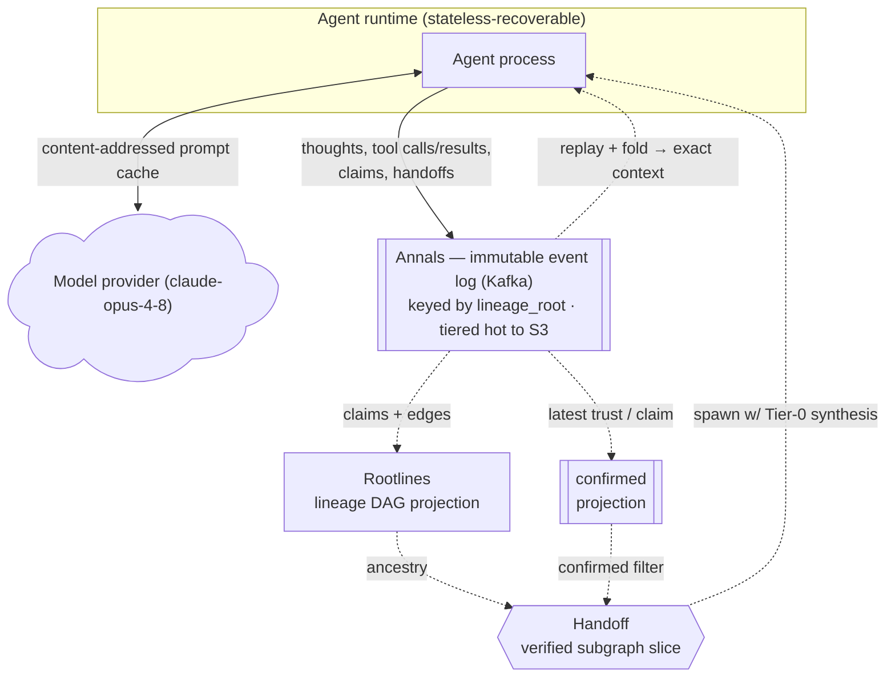
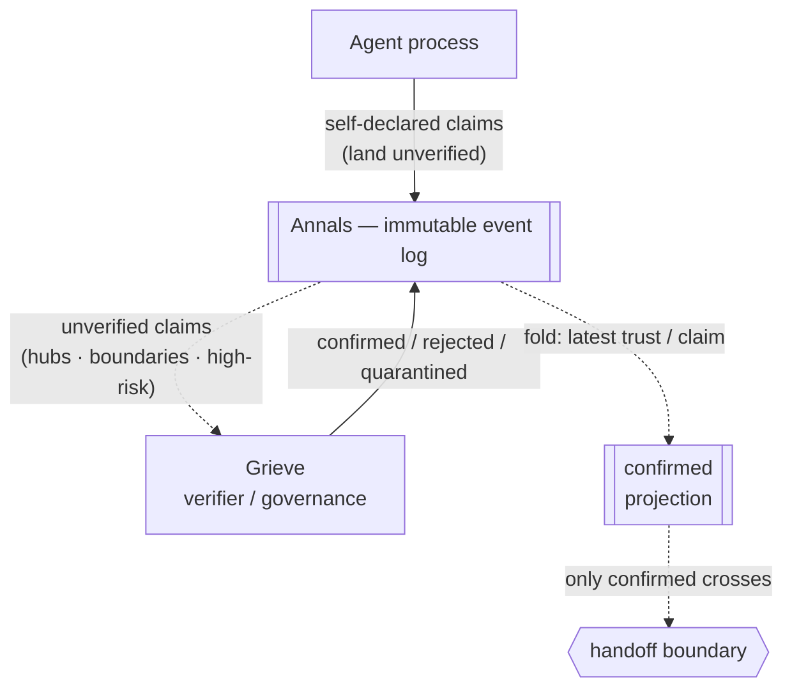
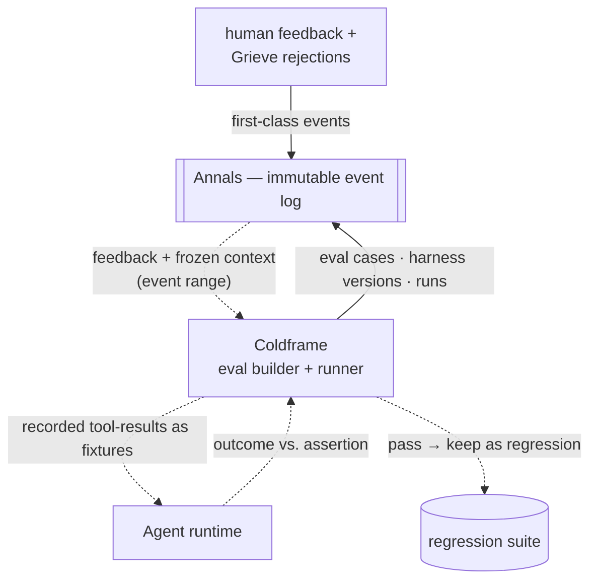

# Greenwood — Architecture

Greenwood is an event-sourced agent runtime and coordination bus on Kafka. Every action
an agent takes is an immutable event; all state is a fold of the log. It exists to run
many LLM agents reliably: resume them across host failures without losing prompt cache,
hand work between them without propagating errors, and turn failures into regression
tests — all from one substrate.

## Founding constraint

Multi-agent systems fail by **error cascade**: one agent's mistake becomes another's
premise and hardens into false consensus. A flat event stream records *what happened* but
not *what derived from what* — so a bad branch can't be traced or pruned. Greenwood makes
the **genealogy** of agentic interactions a first-class structure. The framing — error
cascade, false consensus, and a lineage graph to contain it — leans heavily on
*[From Spark to Fire](https://arxiv.org/abs/2603.04474)* (Xie et al., 2026); much of
Greenwood is an attempt to build a system around that paper's insight.

## Principles

- **P0 — event sourcing end-to-end.** Every input, derived state, control action, and
  correction is an event. State is only ever a fold/projection of the log. No
  out-of-band mutable state — not trust, not lifecycle, not snapshots.
- **Transport, not merge engine.** The bus moves and durably logs events; it never
  decides. Trust, understanding, and coordination are derived downstream.
- **Determinism.** Anything entering a cached LLM prefix is a pure function of the log —
  no wall-clock, UUIDs, or host identity. This is what makes resume and cross-agent
  handoff cache-safe.
- **The claim is the atom.** The unit of trust, provenance, and rollback is an *atomic
  claim* (a minimal, independently-verifiable proposition), not a whole message.

## Diagrams

Across all three: **solid arrows are event writes into the log; dotted arrows are
derivations/reads** (projections, replay, spawns). Annals is the shared spine.

### Core loop — run, persist, resume, hand off

An agent calls the model, logs every action to Annals, and resumes on any host by
deterministic replay. Handoff gives a successor a verified slice of the sender's lineage
(the `confirmed` projection it filters against is filled by Grieve, below).

### Grieve — trust & governance

Grieve runs beside the bus, async: agents propose claims, Grieve disposes trust as
separate events, and `confirmed` is their fold. Rollback is a later `rejected` — a
compensating event, never a delete.

### Coldframe — evals & refinement

A flagged failure becomes a replayable eval: reproduce (must fail first) → tweak the
harness → re-run until it passes → keep it as a regression. Reproduction is hermetic
(only the model varies); eval cases, harness versions, and runs are themselves events.

## Components

### Annals — the event log (spine)
- **Does** — immutable, append-only Kafka log of every event, keyed by `lineage_root` so all events for one interaction branch land in one partition, in order. Tiered: hot local → S3.
- **Solves** — a durable, replayable source of truth with ordered per-branch history.
- **Design** — the log is also the transport, so there's no separate messaging layer. Keying by `lineage_root` (not a random id or agent id) is what gives per-branch ordering, which replay and fold correctness depend on. `confirmed` and Rootlines are compacted views derived from the log, not separate stores of record.

### Event envelope — atomic claims
- **Does** — each record is a typed event: `thought`, `tool_call`, `tool_result`, `claim`, `trust_transition`, `handoff`, `control`, `snapshot`, `stream_delta`. A `claim` carries provenance edges (`derived_from` / `supports` / `contradicts`), an `evidence_ref`, and a `trust_state`.
- **Solves** — a message asserts several things with different truth values, so you can't verify or prune at message granularity.
- **Design** — the claim is the smallest unit with a well-defined truth value, and the unit errors travel through (as premises). Agents declare their own claims and provenance, since only the author knows what it relied on. A `tool_result` is evidence, not a claim. Protobuf + Schema Registry for versioned schemas.

### Rootlines — lineage DAG
- **Does** — a projection over the log: nodes are claims, edges are provenance. Answers `descendants(claim)` (what relied on a claim) and scores centrality / risk.
- **Solves** — tracing an outcome back to its root claims, and finding everything downstream of a claim that later proves false.
- **Design** — a derived read model, rebuildable by replay; kept in a stream state store (RocksDB) and/or a graph DB for edge queries. It's the structure a flat event log doesn't have.

### Grieve — verifier / governance
- **Does** — a separate process that reads claims, screens them, and emits `trust_transition` events (`unverified` → `confirmed` / `rejected` / `quarantined`). `confirmed` is the fold of those events.
- **Solves** — agents can be wrong or prompt-injected, so trust must be set by something other than the agent; and a bad claim has to be actively stopped, since detecting it doesn't by itself stop it spreading.
- **Design** — an agent can't certify its own claims, so a separate process assigns trust. It's async: claims flow immediately and an agent can use its own unverified claims as scratch, but only `confirmed` counts as shared context. Verification is selective (hub roles, handoff boundaries, high-risk claims). Rollback is a compensating event, not a delete. A circuit breaker quarantines claims that keep failing. Grieve's verdicts are events too, so they're auditable.

### Agent runtime — resume + cache continuity
- **Does** — one recoverable process per agent. Loop: fold context → build prompt (with cache breakpoints) → call the model → stream and emit events → run tools → emit claims.
- **Solves** — pods get rescheduled (eviction, OOM, drain, crash), and re-prefilling a long context on a new host is slow and expensive.
- **Design** — state is a deterministic fold of the log, so any host rebuilds the exact same prompt bytes and hits the model's content-addressed prompt cache (1h TTL) — the cache isn't tied to a session or host, so a new pod hits the entry the dead one wrote. Snapshots bound replay cost; content-hash `event_id`s make replay idempotent; an interrupted call is re-issued on resume. A dead agent is picked up by consumer-group rebalance (small fleets) or a claim queue on the `control` topic (larger fleets).

### Handoff — genealogy-based
- **Does** — an agent hands its successor a verified slice of the lineage (seed claims + their confirmed ancestors) as a short Tier-0 synthesis, expandable on demand to the underlying claims (Tier 1) and their evidence (Tier 2).
- **Solves** — passing a raw transcript re-imports the sender's mistakes and can't be traced at the claim level.
- **Design** — only `confirmed` claims cross, so a sender's unverified or rejected claims can't leak into the successor. Provenance edges keep the successor's work traceable to root. The Tier-0 synthesis is entailment-checked against its source claims before it crosses (it can only assert what those claims entail); expansion complements that check rather than replacing it, since the successor reads the synthesis first. The slice is verified on demand before spawn; if a handed claim is later rejected, the successor's branch is rewound. Caching isn't a goal here (a fresh successor starts cold), but the synthesis is still logged — for provenance and the successor's own later resume.

### Coldframe — eval / refinement
- **Does** — human feedback and Grieve's rejections are events. An eval builder freezes the flagged context (an event range) and derives an assertion; a runner replays it and checks the assertion; failures drive harness changes until it passes; the passing case is kept as a regression.
- **Solves** — turning real failures into durable tests, and improving the harness without regressing fixed cases.
- **Design** — replay (built for resume) makes any past failure reproducible. Reproduction is hermetic: recorded tool results are replayed as fixtures, so only the model varies. Evals run N times and pass on a threshold, since model output isn't deterministic. Eval cases, harness versions, and runs are all events. Rootlines lets one eval target a root cause and cover a cluster of related failures.

## How they compose

Determinism is the single mechanism, and the log is the single substrate:

- **Resume** = fold *my own* context.
- **Handoff** = fold a verified slice of *yours*.
- **Rollback** = compensating event + re-fold.
- **Eval** = replay a *frozen* fold.

One log, one fold operation, four capabilities. Rootlines is simultaneously the resume
substrate, the handoff payload, the audit graph, and the eval-targeting index.

## Decisions

Rationale, alternatives, and trade-offs for every choice above are in
[`research/decisions.md`](../research/decisions.md) (**P0** event sourcing; **D1**
claims/verifier; **D2** handoff; **D3** async governance; **D4** evals). Component names
and their reasoning: [`research/NAMES.md`](../research/NAMES.md). The buildable spec
(envelope, topics, fold rules, protocols): [`research/topics/08-concrete-spec.md`](../research/topics/08-concrete-spec.md).
