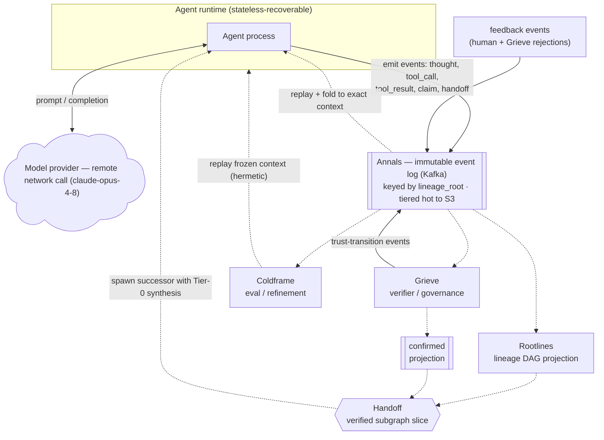

# Greenwood — Architecture

Greenwood is an event-sourced agent runtime and coordination bus on Kafka. Every action
an agent takes is an immutable event; all state is a fold of the log. It exists to run
many LLM agents reliably: resume them across host failures without losing prompt cache,
hand work between them without propagating errors, and turn failures into regression
tests — all from one substrate.

## Founding constraint

Multi-agent systems fail by **error cascade**: one agent's mistake becomes another's
premise and hardens into false consensus. A flat event stream records *what happened* but
not *what derived from what* — so a bad branch can't be traced or pruned. Greenwood makes
the **genealogy** of agentic interactions a first-class structure.

## Principles

- **P0 — event sourcing end-to-end.** Every input, derived state, control action, and
  correction is an event. State is only ever a fold/projection of the log. No
  out-of-band mutable state — not trust, not lifecycle, not snapshots.
- **Transport, not merge engine.** The bus moves and durably logs events; it never
  decides. Trust, understanding, and coordination are derived downstream.
- **Determinism.** Anything entering a cached LLM prefix is a pure function of the log —
  no wall-clock, UUIDs, or host identity. This is what makes resume and cross-agent
  handoff cache-safe.
- **The claim is the atom.** The unit of trust, provenance, and rollback is an *atomic
  claim* (a minimal, independently-verifiable proposition), not a whole message.

## Diagram

*Solid arrows are event writes into the log; dotted arrows are derivations/reads from it
(projections, replay, spawns). The model provider sits outside the runtime — every call
is a network round-trip to a remote model.*

## Components

### Annals — the event log (spine)
**What.** The immutable, append-only Kafka log of every event, keyed by `lineage_root` so
an interaction branch is totally ordered within one partition. Tiered: hot local → S3.
**Problem.** A durable, replayable source of truth with per-branch ordered history.
**Design / why.** Kafka gives event sourcing, real-time transport, replay, and tiered
storage natively — the log *is* the transport, so there is no separate messaging layer.
Keying by `lineage_root` (not a random id, not agent id) is the load-bearing choice: it
guarantees the per-branch causal order that fold correctness and resume depend on.
Projections (`confirmed`, Rootlines) are compacted views derived from it, never the
source of truth.

### Event envelope — atomic claims
**What.** Each record is a typed event: `thought`, `tool_call`, `tool_result`, `claim`,
`trust_transition`, `handoff`, `control`, `snapshot`, `stream_delta`. A `claim` carries
provenance edges (`derived_from` / `supports` / `contradicts`), an `evidence_ref`, and a
`trust_state`.
**Problem.** You cannot govern or prune at message granularity — one message asserts many
propositions with different truth values.
**Design / why.** The claim is the finest unit at which "is this true?" is well-defined,
and it's the unit errors actually propagate through (as premises). Agents **self-declare**
their claims and provenance — they alone know their implicit reliance. `tool_result` is
*evidence*, not a claim. Protobuf + Schema Registry gives versioned, evolvable schemas.

### Rootlines — lineage DAG
**What.** A projection over the log: nodes = claims, edges = provenance. Answers
`descendants(claim)` (rollback blast radius) and computes centrality / risk.
**Problem.** Trace any outcome to its root claims; find everything that relied on a claim
that later proves false.
**Design / why.** A derived, rebuildable-by-replay read model (P0 / transport-not-merge),
held in a stream state store (RocksDB) and/or a graph DB for rich edge queries. It is the
structure a flat log lacks — the reason Greenwood is more than an event stream.

### Grieve — verifier / governance
**What.** A separate process beside the bus. Consumes claims, screens them, and emits
`trust_transition` events (`unverified` → `confirmed` / `rejected` / `quarantined`). The
`confirmed` projection is the fold of those events.
**Problem.** Agents can be wrong or prompt-injected; trust must be established
independently. And error cascades must be *actively contained* — detection alone does not
stop propagation.
**Design / why.** Agent proposes, Grieve disposes: trust is never self-asserted (the
audited party can't certify itself). It runs **async** — claims flow immediately; an agent
may use its own unverified claims as working memory; only the `confirmed` projection
counts as trusted context. Verification is **selective** (hub-role, at trust boundaries,
high-risk). Rollback is a compensating event + re-fold, never a delete (immutability). A
circuit breaker quarantines persistent offenders. Grieve's verdicts are themselves events,
so Grieve is auditable.

### Agent runtime — resume + cache continuity
**What.** One stateless-recoverable process per agent. Loop: fold context → assemble
prompt (with `cache_control` breakpoints) → call LLM (`claude-opus-4-8`) → stream + emit
events → execute tools → emit claims.
**Problem.** Agents run in k8s; pods get rescheduled (eviction, OOM, drain, crash);
re-prefilling long context on a fresh host is slow and expensive.
**Design / why.** Because state is a **deterministic fold** of the log, any host rebuilds
the exact prompt byte-for-byte and hits the LLM's **content-addressed** prompt cache (1h
TTL) — the cache is not tied to a session or machine, so a new pod hits the warm entry the
dead one wrote. Periodic snapshots bound replay cost. In-flight calls are re-issued on
resume (streamed deltas salvage partials). Content-hash `event_id`s make replay
idempotent. Agent acquisition is Kafka consumer-group rebalance (small fleets) or a
`control`-topic claim queue (scale).

### Handoff — genealogy-based
**What.** An agent hands its successor a **verified slice of Rootlines** (seed claims +
their confirmed ancestors), rendered as a Tier-0 synthesis, with lazy expansion to the
underlying claims (Tier 1) and their evidence (Tier 2).
**Problem.** Dumping a transcript re-imports the sender's errors and is untraceable at the
claim level.
**Design / why.** Only **confirmed** claims cross the boundary → error-gating at handoff
(the cascade defense applied to the agent boundary). Provenance edges make the successor's
work traceable to root. The Tier-0 synthesis is **entailment-checked against its source
claims** before it crosses — it may assert only what the confirmed set entails, no
hallucinated or distorted claims (lazy expansion complements this guard, it does not
replace it: the successor reasons over the synthesis first). Boundary gate: entailment-verify
the synthesis and on-demand verify any unexpanded slice claims, spawn on resolve; if a
handed claim later flips `rejected`, emit a rewind on the successor's branch. Caching
is not engineered for at handoff (a fresh successor has a cold cache), but the synthesis is
still logged as an event — for provenance and the successor's own later resume.

### Coldframe — eval / refinement
**What.** Human feedback (and Grieve's `rejected` verdicts) are events. An eval-builder
freezes the flagged context (an event range) and derives an assertion; the runner replays
it and asserts; failures drive harness tweaks until green; the passing case joins a
regression suite.
**Problem.** Turn real-world failures into durable tests, and refine the harness without
regressing fixed cases.
**Design / why.** Replay — built for resume — makes any past failure reproducible; a
failure is *already* a replayable frozen context. Reproduction is **hermetic**: recorded
`tool_result`s are replayed as fixtures, so only the model varies. Evals are **events**
(versioned, auditable) and **statistical** (pass-rate ≥ threshold, since LLMs are
stochastic). Rootlines lets one eval target a root cause and cover a cluster of related
failures.

## How they compose

Determinism is the single mechanism, and the log is the single substrate:

- **Resume** = fold *my own* context.
- **Handoff** = fold a verified slice of *yours*.
- **Rollback** = compensating event + re-fold.
- **Eval** = replay a *frozen* fold.

One log, one fold operation, four capabilities. Rootlines is simultaneously the resume
substrate, the handoff payload, the audit graph, and the eval-targeting index.

## Decisions

Rationale, alternatives, and trade-offs for every choice above are in
[`research/decisions.md`](../research/decisions.md) (**P0** event sourcing; **D1**
claims/verifier; **D2** handoff; **D3** async governance; **D4** evals). Component names
and their reasoning: [`research/NAMES.md`](../research/NAMES.md). The buildable spec
(envelope, topics, fold rules, protocols): [`research/topics/08-concrete-spec.md`](../research/topics/08-concrete-spec.md).
