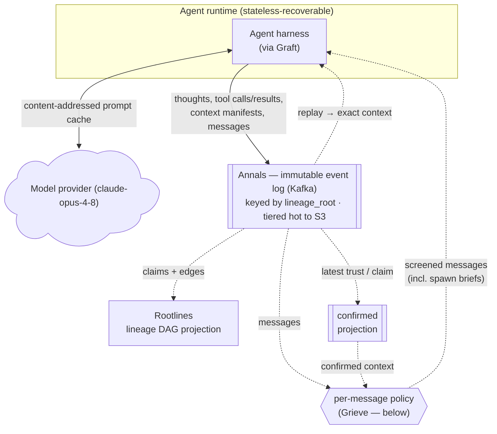
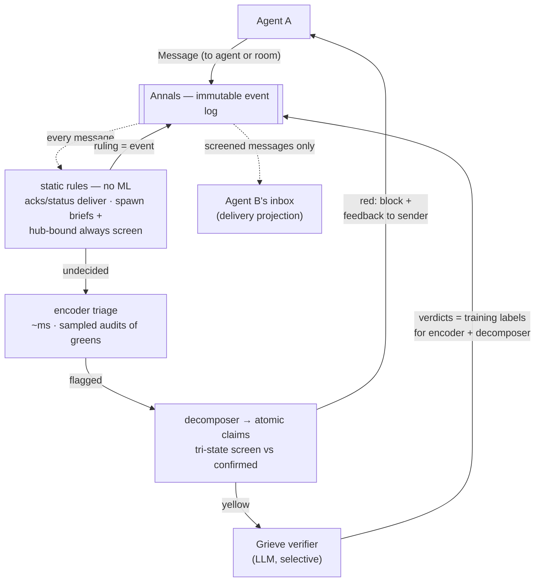
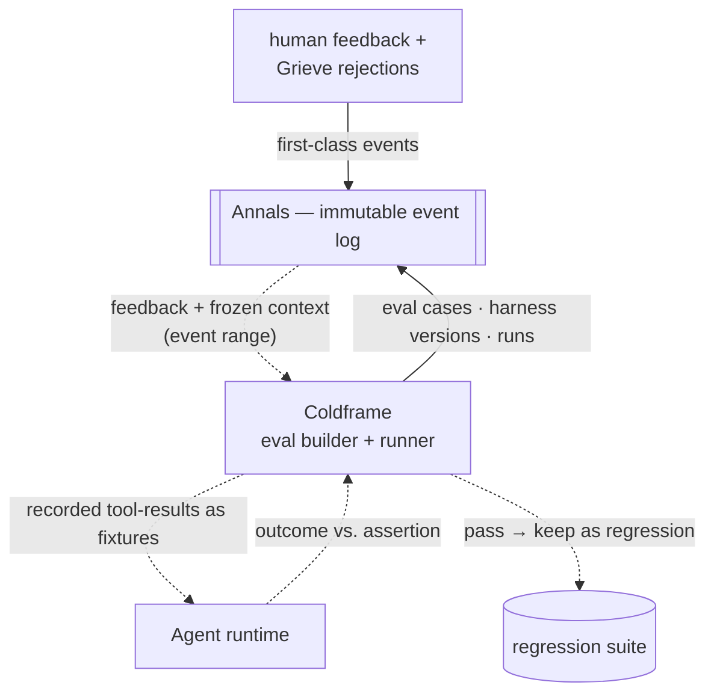

# Greenwood — Architecture

Greenwood is an event-sourced agent runtime and coordination bus on Kafka. Every action
an agent takes is an immutable event; all state is derived by replaying the log. It exists to run
many LLM agents reliably: resume them across host failures without losing prompt cache,
hand work between them without propagating errors, and turn failures into regression
tests — all from one substrate. It is harness-agnostic: any agent loop — Claude Code,
Codex, pi.dev, Hermes, or your own — plugs in through a **Graft** adapter.

## Founding constraint

Multi-agent systems fail by **error cascade**: one agent's mistake becomes another's
premise and hardens into false consensus. A flat event stream records *what happened* but
not *what derived from what* — so a bad branch can't be traced or pruned. Greenwood makes
the **genealogy** of agentic interactions a first-class structure. The framing — error
cascade, false consensus, and a lineage graph to contain it — leans heavily on
*[From Spark to Fire](https://arxiv.org/abs/2603.04474)* (Xie et al., 2026); much of
Greenwood is an attempt to build a system around that paper's insight.

## Principles

- **P0 — event sourcing end-to-end.** Every input, derived state, control action, and
  correction is an event. State is only ever a projection of the log, rebuilt by replaying
events. No
  out-of-band mutable state — not trust, not lifecycle, not snapshots.
- **Transport, not merge engine.** The bus moves and durably logs events; it never
  decides. Trust, understanding, and coordination are derived downstream.
- **Determinism.** Anything entering a cached LLM prefix is a pure function of the log —
  no wall-clock, UUIDs, or host identity. This is what makes resume cache-safe.
- **Messages are the only inter-agent primitive.** Agents communicate by messages (to an
  agent or a room); nothing else crosses agents — so the message path is the one place
  governance must stand, and the only place it eagerly runs (D8).
- **The claim is the atom.** The unit of trust, provenance, and rollback is an *atomic
  claim* (a minimal, independently-verifiable proposition), not a whole message.

## Diagrams

Across all three: **solid arrows are event writes into the log; dotted arrows are
derivations/reads** (projections, replay, spawns). Annals is the shared spine.

### Core loop — run, persist, resume, message

An agent calls the model, logs every action to Annals, and resumes on any host by
deterministic replay. Everything inter-agent — chat, results, spawn briefs — is a
message, and every message gets a policy ruling before delivery (the screen and the
`confirmed` projection it consults are Grieve's, below).

### Grieve — trust & governance

Agents communicate **only by messages** (to an agent or a room), and the message path is
the only place eager governance runs — the same scope the *Spark to Fire* middleware
measured, because cascades propagate through communication, not computation. Each message
gets a **policy ruling** (logged as an event) from a cheapest-first cascade: static rules
(free, no ML — typed acks deliver, spawn briefs and hub-bound messages always screen),
then a milliseconds encoder (greens deliver, with a sampled-audit rate that makes the
false-green rate a measured SLO), then bus-side decomposition + tri-state screening, then
selective LLM verification. A recipient's inbox is a projection of screened messages —
only screened content ever enters trusted context. Verifier verdicts and audit
divergences continuously re-tune the encoder and distill the decomposer (each new model
version gated through Coldframe). Intra-agent work is captured and manifested but never
eagerly decomposed — the immutable log makes retroactive decomposition free for
forensics. Rollback is a later `rejected` — a compensating event, never a delete.

### Coldframe — evals & refinement

A flagged failure becomes a replayable eval: reproduce (must fail first) → tweak the
harness → re-run until it passes → keep it as a regression. Reproduction is hermetic
(only the model varies); eval cases, harness versions, and runs are themselves events.

## Components

### Annals — the event log (spine)
- **Does** — immutable, append-only Kafka log of every event, keyed by `lineage_root` so all events for one interaction branch land in one partition, in order. Tiered: hot local → S3.
- **Solves** — a durable, replayable source of truth with ordered per-branch history.
- **Design** — the log is also the transport, so there's no separate messaging layer. Keying by `lineage_root` (not a random id or agent id) is what gives per-branch ordering, which correct replay depends on. `confirmed` and Rootlines are compacted views derived from the log, not separate stores of record.

### Event envelope — atomic claims
- **Does** — each record is a typed event: `thought`, `tool_call`, `tool_result`, `claim`, `trust_transition`, `message`, `policy_decision`, `context_manifest`, `control`, `snapshot`, `stream_delta`. A `claim` carries provenance edges (`derived_from` / `supports` / `contradicts`), an `evidence_ref`, and a `trust_state`.
- **Solves** — a message asserts several things with different truth values, so you can't verify or prune at message granularity.
- **Design** — the claim is the smallest unit with a well-defined truth value, and the unit errors travel through (as premises). Claims are decomposed bus-side by Grieve; provenance comes mechanically from the runtime's per-turn `context_manifest` (the runtime built the prompt, so it knows what was relied on) — agents never author the graph that governs them (D7). A `tool_result` is evidence, not a claim. Protobuf + Schema Registry for versioned schemas.

### Rootlines — lineage DAG
- **Does** — a projection over the log: nodes are claims, edges are provenance. Answers `descendants(claim)` (what relied on a claim) and scores centrality / risk.
- **Solves** — tracing an outcome back to its root claims, and finding everything downstream of a claim that later proves false.
- **Design** — a derived read model, rebuildable by replay; kept in a stream state store (RocksDB) and/or a graph DB for edge queries. It's the structure a flat event log doesn't have.

### Grieve — verifier / governance
- **Does** — rules on every inter-agent message before delivery, via a cheapest-first policy cascade: static rules (no ML) → encoder triage → decomposition + tri-state screen → selective LLM verification. Emits `policy_decision` and `trust_transition` events; `confirmed` is the running trust view.
- **Solves** — agents can be wrong or prompt-injected, so trust must be set by something other than the agent; and a bad message has to be actively blocked, since detecting it doesn't by itself stop it spreading.
- **Design** — governance runs on the message path only (D8): cascades propagate through communication, so that's where screening pays; intra-agent work is captured + manifested but only decomposed retroactively (the log is immutable, so forensics lose nothing). Static rules are free and deterministic — typed acks/status deliver untouched; spawn briefs and hub-bound messages always screen (hub fragility is where blast radius lives). The encoder's green-lights carry a sampled-audit rate, making the false-green rate a measured SLO. Decomposition is bus-side and provenance mechanical (D7) — the audited party never authors the graph the auditor samples from. Verifier verdicts + audit divergences continuously re-tune the encoder and distill the decomposer (new versions gated through Coldframe). Rollback is a compensating event, not a delete. A circuit breaker quarantines claims that keep failing. Grieve's rulings and verdicts are events too — auditable, and periodically audited for verifier drift.

### Agent runtime — resume + cache continuity
- **Does** — one recoverable process per agent. Loop: rebuild context (replay the log) → build prompt (with cache breakpoints) → call the model → stream and emit events → run tools → emit the turn's context manifest (claims are decomposed bus-side — D7).
- **Solves** — pods get rescheduled (eviction, OOM, drain, crash), and re-prefilling a long context on a new host is slow and expensive.
- **Design** — an agent's state is derived deterministically from its logged events, so any host rebuilds the exact same prompt bytes and can hit the model's content-addressed prompt cache — the cache is scoped to the API workspace, not to a session or host, so a new pod hits the entry the dead one wrote. Cache continuity is an opportunistic latency win, not an economic pillar: it pays off within the cache TTL (a per-agent policy set by turn cadence — 5-min default; 1h only for slow-cadence agents, since its write premium exceeds the crash-resume payout otherwise), and it's best-effort for third-party harnesses (see Graft). Snapshots bound replay cost; content-hash `event_id`s make replay idempotent; an interrupted call is re-issued on resume. A dead agent is picked up by consumer-group rebalance (small fleets) or a claim queue on the `control` topic (larger fleets), with a per-session epoch fencing out zombie producers.

### Graft — harness adapters
- **Does** — an adapter that plugs an agent harness (Claude Code, Codex, pi.dev, Hermes, or your own) into Greenwood by translating its native loop onto the event envelope + a lifecycle protocol (`init / step / snapshot / resume / stop`). Ships as a protocol spec, per-language SDKs, a conformance suite, and reference grafts.
- **Solves** — Greenwood shouldn't be tied to one harness; supporting a new one should mean writing an adapter, not changing the bus.
- **Design** — the bus's only external contract is the event envelope and the lifecycle protocol, so a graft is the only per-harness code. Conformance is two-tier: correctness (resume rebuilds correct state — required) and cache-continuity (byte-identical prompt so the cache hits — best-effort; a harness that can't meet it still resumes, just paying a prefill). Grafts run as sidecar processes (gRPC) or in-process. Harnesses are never claim-aware — Greenwood decomposes claims from raw output bus-side for every harness (D7), so a graft only has to relay output and lifecycle.

### Messaging — the inter-agent primitive
- **Does** — agents communicate by `message` events, addressed to an agent or a room; a recipient's inbox is a projection of messages whose policy ruling permits delivery. Spawning a sub-agent is just a message (`SPAWN_BRIEF`) plus a `spawn` control event.
- **Solves** — every inter-agent channel is also a cascade channel, so there must be exactly one kind of crossing, with governance standing on it. (Handoff, the old primitive, dissolved into this: a spawn is a message; a successor-after-death is a resume.)
- **Design** — messages ride the same log as everything else (no separate messaging layer); rooms are an addressing convention, not a broker feature. Blocked messages return to the sender as a feedback package. The **spawn-brief pattern** keeps D2's machinery as a library: compose the brief from the confirmed provenance subgraph, entailment-check the Tier-0 synthesis against its source claims before it crosses (the check is a stochastic filter with a monitored false-pass rate; two independent checkers for high-risk spawns), lazy-expand to claims (Tier 1) and evidence (Tier 2) on demand. Static policy routes every spawn brief to full screening, so the old boundary gate falls out of ordinary message governance rather than existing as a separate mechanism. If a delivered claim is later rejected, recipients' branches are rewound (belief repair + compensation — see below).

### Coldframe — eval / refinement
- **Does** — human feedback and Grieve's rejections are events. An eval builder freezes the flagged context (an event range) and derives an assertion; a runner replays it and checks the assertion; failures drive harness changes until it passes; the passing case is kept as a regression.
- **Solves** — turning real failures into durable tests, and improving the harness without regressing fixed cases.
- **Design** — replay (built for resume) makes any past failure reproducible. Reproduction is hermetic: recorded tool results are replayed as fixtures, so only the model varies. Evals run N times and pass on a threshold, since model output isn't deterministic. Eval cases, harness versions, and runs are all events. Rootlines lets one eval target a root cause and cover a cluster of related failures.

## How they compose

The four big capabilities are the same idea at different scopes — reconstruct state by
replaying the log:

- **Resume** — replay an agent's own history to rebuild its exact context.
- **Messaging** — deliver only screened slices of history across agents (a spawn brief is
  the curated case of this).
- **Rollback** — append a corrective event; downstream *derived state* re-derives, nothing
  is deleted. Scope honesty: this repairs **belief**, not the world — external tool
  effects don't rewind. Reversible effects run registered compensation handlers (as
  events); irreversible ones require confirmed premises *before* execution (the effect
  gate) and human remediation after. And re-deriving an LLM branch is regeneration at
  inference cost, not a deterministic re-fold.
- **Eval** — replay a saved slice of history to reproduce a past run.

Because they share that one move, they share one implementation. Rootlines carries all of
it: the resume substrate, the message-slice source, the audit graph, and the index evals target.

## Cost

Three buckets, very different in character: **state capture / replay** (storage +
transport — cheap; low tens of $k/yr for 500 agents on an object-store-native engine),
**eval inference** (re-running flows through the model — large at any real regression
cadence), and **governance inference** (the per-message policy cascade — the marginal
cost Greenwood itself adds; it scales with communication, not computation, so topology
is a cost dial, and the real ROI question is whether it's paid back by avoided
cascade-redo).
Full model and the 500-agent-year worked estimate:
[`research/topics/11-scalability-and-cost.md`](../research/topics/11-scalability-and-cost.md).

Explore configurations at any fleet scale — token-native workload → tiered S3 (hot /
Standard / IA / Glacier or Intelligent-Tiering) + PUT/GET requests + eval inference, across
AutoMQ / Kafka / raw-S3. Compute is sized bottom-up (nodes = throughput ÷ per-node capacity,
floored at an HA minimum), so it holds flat at small scale and grows with load:

- **Interactive calculator (live):** <https://pin.bitcomplete.dev/public/p/01KWJYMAFC3RAK1M4WRMCCXJNP?token=4O-GgIjEddsPL8Gx6AiLZKR1p5NvuAztADfxNiy7QO0> *(public link, expires 2026-08-01)*
- **Source (permanent):** [`research/cost-model/calculator.html`](../research/cost-model/calculator.html)

## Decisions

Rationale, alternatives, and trade-offs for every choice above are in
[`research/decisions.md`](../research/decisions.md) (**P0** event sourcing; **D1**
claims/verifier; **D2** spawn briefs; **D3** async governance; **D4** evals; **D7** bus-side
decomposition; **D8** messaging + per-message policy). Component names
and their reasoning: [`research/NAMES.md`](../research/NAMES.md). The buildable spec
(envelope, topics, projections, protocols): [`research/topics/08-concrete-spec.md`](../research/topics/08-concrete-spec.md).
